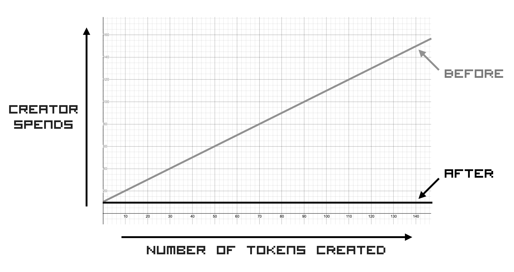
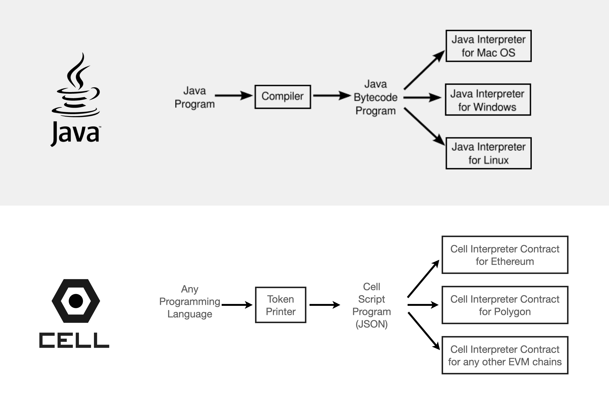

# Introduction

Cell is an NFT virtual machine protocol.

Instead of deploying a fixed smart contract logic onto the blockchain, you deploy a Cell virtual machine, and do all the programming logic OUTSIDE the blockchain.


While a traditional NFT contract requires you to program **hardcoded logic** BEFORE deployment, the Cell virtual machine smart contract lets you program all the token minting logic AFTER deployment.

This has the exact same benefits of the traditional NFTs but with much more flexibility, extreme efficiency, and ultimate portability.


---

# Problem

Here are some of the limitations of the NFT technology today:

## Inflexible

NFT Smart contracts are like hardware. Once you ship them, the logic is fixed, you can't change them.


Just like how a refrigerator company cannot sell a refrigerator and then somehow remotely morph it to an oven AFTER it's been sold, the behavior of smart contracts are decided BEFORE they are deployed, and it is difficult to try out different ways tokens can be minted once a contract has been deployed.

- You cannot add more logic once deployed.
- You cannot change logic once deployed.
- You can only program the global logic of the contract. You cannot program each token's logic individually.

Imagine you wanted to run a business with NFT, where you sell NFTs as access tokens to your business.

1. Sometimes you may want to raise the mint price of tokens
2. Sometimes you may want to raise (or lower) the mint price of only one specific token
3. Sometimes you may want to give away the tokens for free, but only the ones you want to give away
4. Sometimes you may want to do a flash sale, but only for a limited time only
5. Sometimes you may want to let people claim tokens only if they fit certain conditions

Trying to hard-code all of this into a contract is inefficient and not feasible.

---

## Complicated


To deploy your own NFT collection with customizable features, there's a lot of things to learn, such as Solidity, IPFS, Web3, and so on.


These technologies collectively have a fairly high learning curve and risk factors, which makes it difficult for anyone to just build their own NFT collection in minutes like they publish a blog post.

There do exist several **service providers** that let you mint NFTs through their platforms, but there are many drawbacks:

1. cannot easily extend your NFT community to include features not provided by the service providers
2. can't build a completely open community around your NFT collections
3. risk censorship 
4. have to rely on a 3rd party infrastructure
5. give up flexibility and customizability

---

## Platform dependent

There are many blockchains out there. While it is not difficult to write one contract and deploy to many blockchains since many blockchains share the same codebase (EVM or Bitcoin), it is still near impossible to easily port NFTs from one blockchain to another.


The main issue is the **unique resource identifier**. NFTs traditionally have been identified by their location, not their content. 

When we talk about NFTs, we identify them by asking the following questions:

1. **host blockchain:** Which blockchain is it on?
2. **contract address:** Which contract is it on?
3. **tokenId:** What is the tokenId within the contract?

You may have a single image you want to turn into NFT. The `tokenId` for the image will be different depending on where you host the NFT.

Because the **tokenIds are blokchain dependent**, the NFTs using this scheme are naturally blockchain dependent and not easily portable. It is not easy for NFTs to cross over from one blockchain to another.

Practically speaking, this is a very real risk factor for anyone thinking about issuing some valuable asset as an NFT.

- **Uncertainty:** There are a lot of blockchains, and you don't know which one will stick around in the future. Your NFT's value may go to zero if the host blockchain's value goes to zero, regardless of the content stored in the NFT.
- **Switching costs:** Furthermore, if you suddenly need to switch to using another blockchain, you need to re-learn all the tech around the new blockchain. You have to do this for every new blockchain you need to use, which is very inefficient.

---

## Everything costs money

With a typical NFT contract, because all the token related logic is stored inside an NFT smart contract on the blockchain, everything costs money:

1. Configuring costs money
2. Adding or updating invites (if you implemented an invite scheme) costs money
3. Creating a token costs money for the creators


These things add up, and it becomes too expensive to do experiments.

- Doing experiments is expensive
- Creating lots of tokens is expensive
- Trying multiple minting/pricing strategy for the same NFTs is not feasible

The barrier to experimentation is simply too high for NFTs. Even the people who think they are doing fine publishing NFTs are not really taking full advantage of what NFTs can do for them. For example, nobody even imagines making millions of NFTs because of the cost.

---

## Handcrafted only

We take for granted that NFTs are something that can only be created manually by human, and cannot be automated..

All existing NFT frameworks are focused on creating static NFT collections where humans always need to be involved from the beginning till the end. Even the so-called "generative art" NFT projects require a human being to run a generative art program first, and manually publish the result afterwards.

For example, you cannot have a "robot generative artist" automatically print out NFTs perpetually and make money from the art.


This is a huge limitation. This means it is not possible for a machine to automatically print out NFTs perpetually without human intervention.

- Imagine you wanted to incorporate NFT into your entire supply chain, where every product produced gets assigned a unique NFT automatically.
- Imagine you wanted to automatically tokenize in-game items as they are generated, either by NPCs or by the user.

Such things are not possible with the existing state of the NFT technology.

---

# Solution

Cell takes a Virtual Machine approach to NFTs.

Instead of building NFT collections that rely on a single blockchain, Cell provides a "virtual machine" that lets you create **universally unique** NFTs that can transcend blockchains.

---

## Dynamic programmability

Once you deploy a smart contract, you can't change the logic. This is analogous to a calculator being able to do only one thing: calculation.


On the other hand, the Cell contract does NOT include any collection specific logic, but includes an interpreter which makes dynamic programmability possible. This is analogous to owning a smart phone. Because each token can be individually programmed AFTER the contract deployment, we have much more flexibility working with NFTs.

We can describe the difference as **Fat Contract vs. Lean Contract**:


### Fat contract

Traditionally, NFT contracts have been all about **writing as much collection-specific logic into the contract as possible**.


### Lean contract

With Cell, instead of writing all the collection specific logic into the contract, you initially deploy only a minimal **virtual machine**.

Then going forward, this virtual machine contract can interpret and execute signed messages (Offchain token scripts) created by humans or machines to mint them onto the blockchain.

---

## Simple

The Cell virtual machine abstracts out all the messy and complicated details you need to deal with, so you can focus on the real thing that matters: The NFT logic.


How simple?

**Creating tokens DO NOT even involve connecting to the blockchain network.** You can create tokens completely offline even without an Internet connection.

This means **You do not even need to deal with the blockchain at all!** 


Thanks to the virtual machine, you can create NFTs without needing to understand all the blockchain stuff or other decentralized tech stuff like IPFS. All you need to know is JavaScript. Or you can also use your favorite language to create tokens over simple RPC calls to the virtual machine.

---


## Platform independent


Cell is a minimal virtual machine in a smart contract. Instead of deploying a fully hard-coded smart contract onto the blockchain, you deploy a virtual machine which can interpret incoming signed messages (called "offchain token script") and mint them into **onchain tokens**.

Also it implements a universal URI to reference each token, which makes every token ever printed with Cell universally unique and platform independent.

Traditionally, NFTs have been uniquely identified by arbitrarily assigning tokenIds such as 1, 2, 3, etc. This works for one chain but does not scale out side of a single chain because you can have different tokenIds for the same token, depending on the blockchain. 

Cell solves this problem with a universally unique tokenId system powered by IPFS (More on this in the "universal token ID" section)

> **NOTE**
>
> Currently Cell is deployed on Ethereum and Ethereum Testnet only, but it has plans to support all EVM compatible blockchains out of the box, and may support non EVM chains in the future.

---

## Unlimited tokens at zero cost

Cell was designed to get rid of all the maintenance costs and minting costs completely.

- **BEFORE:** With the traditional NFT architecture, everything costs money and you can't easily experiment with different ideas.
- **AFTER:** With Cell, EVERYTHING is free (except for a one time gas fee for when you deploy the contract at the beginning).



1. **One time spend:** The ONLY time you need to spend any money is for paying for gas at the beginning when you deploy the contract. From that point on, everything is completely FREE for the creators because the creators can create tokens, configure them, and do many other things completely outside of the blockchain, thanks to the virtual machine architecture.
2. **Create millions and billions of tokens for FREE:** With the virtual machine approach, the process of "creating" and "minting" of tokens are unbundled, which means the creator can create as many tokens as they want without spending any money, and allow the "minters" to mint the created tokens. The creator can also be the minter, or they can be different parties.
3. **Minters pay:** The creators simply create tokens, as many as they want. It is the minters who pay for the gas for minting the created tokens onto the blockchain, and even this gas fee has been optimized with Cell.
4. **No platform fee:** There is no "platform", and there is no fee charged by anyone. Cell is a 100% open and ownerless system.

---

## Can be automated

Most NFTs until now have been **manually created by humans**. This includes even the "generative art" NFTs, because the actual creation of each token is always triggered by human interactions.

On the other hand, Cell is built not only for manual tokenization, but also automated tokenization. It is optimized for automation.

For example, you can build an autonomous tokenization bot that keeps printing tokens algorithmically, based on its interaction with humans, or based on its interaction with other bots.

These tokens then can be minted onto the blockchain.


1. **Automatic tokenization:** Because you do not have to manually approve signature every time you need to create a token, this can be used to seamlessly tokenize anything on your computer without your intervention.
2. **Embeddable token printer:** Through its abstraction, you can create NFTs without ever directly touching all the complicated technologies like solidity, IPFS, and wallets. This also means it's effortless to embed Cell into ANY program to automatically tokenize anything that happens inside those apps.
3. **Natural resources in a virtual world:** imagine you want to create a virtual world made up of NFTs as natural resources. You can't just create a single "10K item drop" and call it a day. You want the items to constantly be created or morphed, and the minting difficulty increase or decrease based on market conditions. This is only possible when you can automatically tokenize things.

---

# Technology

> Build once, deploy anywhere.

Let's use a Java analogy to explain the "virtual machine" concept for NFT contracts.



With Java virtual machine, the Java compiler creates a bytecode, which then can run on various virtual machines installed on different platforms like Windows, Linux, Mac, etc.

With Cell virtual machine, the Cell printer module (called [Nuron](https://nuron.cell.computer)) creates offchain token "scripts", which then can be fed to various Cell virtual machines installed on different blockchains like Ethereum, Polygon, etc.

The virtual machine contract is implemented using:

1. Offchain signed tokens (the "bytecode")
2. Onchain smart contract that accepts the offchain signed tokens as input and authorizes minting.

Instead of directly minting onchain tokens, you go through two steps:

1. **CREATE:** you first create the above "offchain token", which is a signed message that describes a token's behavior once minted.
2. **MINT:** then the created JSON object can be submitted to the blockchain to mint the described token.

## Offchain Token Script

If Java has bytecode, Cell has offchain token script.


Each token is a JSON object that contains:

1. Token information
2. Minting condition
3. Cryptographic signature

Here's the schema for a token:

```json
{
  body: {
    cid: cid,                           // IPFS CID of the NFT metadata => The NFT information
    id: id,                             // The tokenId of the NFT => can be derived from the cid
    raw: raw,                           // IPFS encoding (true if raw, false if dag-pb)
    minter: minter,                     // who is allowed to mint this token?
    minters: minters,                   // which group of addresses can mint this token? (merkle tree)
    price: price,                       // how much needed for minting this token?
    start: start,                       // when does the minting start? (unix timestamp in seconds)
    end: end,                           // when does the minting end? (unix timestamp in seconds)
    royaltyReceiver: royaltyReceiver    // royalty receiver for this token
    royaltyAmount: royaltyAmount        // royalty amount for this token (out of 1,000,000)
  },
  domain: {
    name: contract_name,
    chainId: chainId,
    verifyingContract: contract_address,
    version: "1"
  }
}
```

Each token (a signed JSON object) is effectively a command you can submit to the "onchain virtual machine", described below.


## Onchain Virtual Machine


The "virtual machine" is essentially an [ERC721 NFT contract](https://eips.ethereum.org/EIPS/eip-721) that executes the **token script** submitted from outside of the blockchain.

It has the following properties:

1. **Clean Slate ERC721:** No collection specific logic (the logic is not hardcoded to the contract, it's embedded in the token scripts that get submited to the VM). Only the ERC721 NFT standard + virtual machine interpreter implementation.
2. **Auth Engine:** Implements the logic that authenticates and authorizes whether to allow an offchain to be minted or not
3. **Minter:** Once the auth check passes, the offchain token can be minted onto the blockchain as an "onchain token". And from this point the token behaves exactly the same as any other ERC721 tokens.

---


## Universal Token ID

One of Cell's main innovations is the **"universal token Id"**, which is a [content addressable](https://en.wikipedia.org/wiki/Content-addressable_storage) tokenId system that **natively** leverages the [IPFS CID](https://proto.school/content-addressing) scheme **on-chain**. So how does this work?

> **In short, the universal tokenId system takes the same IPFS-based `tokenURI` approach adopted by most NFT collections, and applies it even to the `tokenId`s, on-chain.**

### Old way: Location based tokenIds

Most existing NFT contracts use **location based tokenIds**, which means you can only uniquely identify each token location-wise, using the combination of the following "location" attributes:

1. The blockchain it's hosted on
2. The contract address of the collection
3. The tokenId of the token within the collection

We can formulate this **"location based token addressing** in the following form:

```
<chainId>.<contractAddress>.<tokenId>
```

Let's look at an example. The following NFT has a tokenId of **2087** https://opensea.io/assets/0xbc4ca0eda7647a8ab7c2061c2e118a18a936f13d/2087


In this case, we can express this token's location as:

```
1.0xbc4ca0eda7647a8ab7c2061c2e118a18a936f13d.2087
```

Where the `1` represents Ethereum ([Ethereum's chainId is 1](https://chainlist.org/))

As we can see, the tokenId **2087** is just an arbitrary number and has nothing to do with the uniqueness of the content itself.

For example, there is no one stopping you from:

1. Using the same image but give it a tokenId of 3000
2. Using a different image to create the token 2087
3. Create a new contract and use the same image to create a "different" token

Basically, the tokenIds are arbitrary and have nothing to do with the uniqueness of the tokens they represent.

Therefore this kind of tokenId system does not uniquely identify digital objects and is not portable across blockchains.

You may be able to make it work on one blockchain, but if you need to migrate to another blockchain in the future (or if you want to use multiple blockchains simultaneously), this tokenId system is the biggest bottleneck to your NFT portability.

### Cell way: Content addressable tokenIds

Cell implements a **Universal tokenId** system with the following properties:

1. **Content-addressable:** tokenIds are deterministically calculated from the token's metadata using the same [multiformats](https://multiformats.io/) algorithm used by the [IPFS CID v1 scheme](https://docs.ipfs.io/concepts/content-addressing/#identifier-formats). 
2. **Universally unique:** Just like how all the files stored on IPFS have universally unique identifiers (CIDs) regardless of where (which machine) they are stored, Cell's tokenIds--regardless of where (which blockchain) they are stored--have universally unique identifiers (tokenIds).
3. **The tokenId is the tokenURI:** Typically tokenIds and tokenURIs have nothing to do with each other in NFT collections. You can have a tokenId of 1 and a tokenURI of `ipfs://bafybeicaivkonz2sofegu2thshbeod3723ye2i5c5ivsyhv7gyuyunyyoq`, and they are completely unrelated. But with Cell, the `tokenId` is deterministically derived from the `tokenURI`.
4. **Onchain IPFS resolution:** To implement this, the Cell smart contract has implemented a native on-chain IPFS resolution function that **calculates the tokenURI** instead of storing it, which lowers the gas cost and makes the contract super efficient.
5. **100% ERC721 compliant:** Even while implementing all these schemes, Cell keeps the tokenIds 100% compliant to the [ERC721 standard](https://eips.ethereum.org/EIPS/eip-721). More specifically, every tokenId is a unique `uint256` type identifier derived from the NFT metadata.

Here's a quick overview of how it works:

1. **[offchain]** When creating a token, you supply the IPFS CID of the token metadata
2. **[offchain]** The offchain token printer ([Nuron](https://nuron.cell.computer)) creates a JSON token script object with 2 attributes: `id` and `raw`, which are deterministically derived from the original CID. The `id` is the `uint256` tokenId, and the `raw` is used to store the encoding ("raw" or "dag-pb") of the original IPFS CID supplied.
3. **[onchain]** The created token script is submitted to the onchain virtual machine
4. **[onchain]** The onchain virtual machine runs the authorization logic and if everything is valid, it mints the token with the `id` as the tokenId (as well as storing the `raw` (encoding) attribute internally). Note that we do not need to store a separate `tokenURI`.
5. **[onchain]** Whenever the token is queried, the `tokenURI` attribute is calculated on the fly from the `tokenId` and the `raw` attributes later) through an onchain IPFS CID encoder engine.


---

## NFT Containerization

The Cell framework lets you store and manage everything you need in a self-contained **Workspace**.

This is similar to how application containerization technologies like [Docker](https://docker.com) makes applications portable across multiple platforms by packaging everything into a replicable and portable image:


Just like how Docker packages everything in a self-contained way that can run exactly the same on every platform, Cell packages everything in a self-contained way that can run exactly the same on multiple blockchains (EVM compatible blockchains for now).


Here's an example file system created by [Nuron](https://nuron.cell.computer), the "token management system" used by Cell:

```
<YOUR_HOME_DIRECTORY>
│
└── __nuron__
    └── v0
        └── home
            ├── config.json
            └── workspace
                │
                ├── <WORKSPACE 1>
                │   ├── db
                │   │   └── mixtape.db
                │   ├── fs
                │   │   ├── <IPFS file 0>
                │   │   ├── <IPFS file 1>
                │   │   ├── <IPFS file 2>
                │   │   ├── . . .
                │   │   └── <IPFS file n>
                │   └── web
                │       ├── index.html
                │       └── token.html
                │
                └── <WORKSPACE 2>
                    ├── db
                    │   └── mixtape.db
                    ├── fs
                    │   ├── <IPFS file 0>
                    │   ├── <IPFS file 1>
                    │   ├── <IPFS file 2>
                    │   ├── . . .
                    │   └── <IPFS file n>
                    └── web
                        ├── index.html
                        └── token.html
```

Each workspace folder contains everything you need to recreate an NFT collection:

1. **DB:** You can store the offchain tokens as well as token metadata in an SQLite database at `db/mixtape.db`
2. **Files:** Files are stored under the `fs` folder
3. **Website:** Statically generated websites for all your minting needs (you can customize yourself too)

This is extremely portable and flexible.

1. **Publish on the Web:** You can publish your entire NFT collection instantly on the web. Just need to publish the entire workspace.
2. **Publish as Git repository:** The entire workspace is packaged as a git repository, so you can instantly push it to git hosting services like GitHub, GitLab, etc. to version control your NFT collections as well as share them with your NFT collector community (to help them build derivative NFTs, etc.)
3. **Share Privately:** You can even share your NFT collection privately. Just zip the workspace file and send it over email
4. **Share over any Network:** You can use any network transport mechanism to share your NFT collections. For example you can post the entire workspace on [IPFS](https://ipfs.io/), [Hypercore](https://hypercore-protocol.org/), [BitTorrent](https://en.wikipedia.org/wiki/BitTorrent).

Each workspace is 100% **self contained and portable**, and has everything you need to browse and interact with your NFT collections, even including the website. Here's a "search engine" example (https://mferbase.mixtape.network):


---

# Use Cases

## Ondemand Minting

Instead of pre-populating an NFT collection with your own content, allow users to create their own NFTs through your interactive NFT engine (such as web app, etc).

## Storefront Collections

Build NFTs that have a "storefront" interface, where each token is programmed with a different minting condition.

## Discounts, Giveaways, Raffle, Puzzles

Since you can program each token using the **token script**, and since you can write multiple token scripts for the same token, you can implement all kinds of ways to distribute your NFTs including:

1. **Discounts:** Lower the price for a limited time only using the `start` and `end` opcodes
2. **Giveaways:** Run various giveaway campaigns using the onchain `gift()` function, or using the token script using the opcodes such as `minter`, `minters`, etc.
3. **Puzzles:** Create hash puzzles. The first people to solve the puzzle can mint the token.
4. **Raffle:** Build an offchain raffle infrastructure and use the `gift()` function or the `minter` token script opcode to give away NFTs.

## Automated NFT publishing

Because Cell does not directly rely on the blockchain to create tokens (only need to connect to the blockchain when they need to be minted), you can create a perpetual autonomous NFT engine that keeps printing NFTs algorithmically.

## Autonomous AI NFT Artists

Because everything can be automated, it is even possible to create a fully self-sustainable AI artist that prints NFTs and makes money when people mint the automatically printed NFTs.


## Enterprise NFTs

NFTs are currently used mostly for speculative purposes because of the lack of scalability in most blockchains, as well as the requirement to rely on 3rd party APIs to work with NFTs (such as RPC providers).

1. **Self-sufficient:** Cell has gotten rid of all the 3rd party depenencies so anyone can fully own their entire NFT stack and UX without spending any money to any 3rd party, and without relying on a 3rd party infrastructure for anything.
2. **Scalable:** Because you can create unlimited tokens without being limited by the blockchain bandwidth, you can create millions and billions of tokens without worrying about the cost. For example you can create a million item collection, and only 1000 of them could end up being minted by the NFT minters, but it will still be profitable.

## Private NFTs

You can even create NFTs whose contents are private, while making use of the transparent public blockchains for tracking their ownership.

Because the workspace creates a local file system for all the files WITHOUT needing to publish to the IPFS network, you can easily tokenize private files, which then can be shared among a private group (or a public group of authorized users).

---
