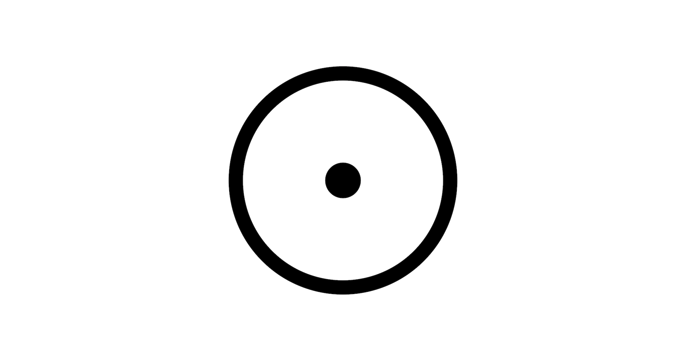

# Cell

> Ultra-scalable Decentralized NFT Kit



Cell is a new way to build NFT collections. It is optimized for hyper-scalable NFT collections:

1. **100% IPFS Native:** Cell doesn't just store images and metadata on IPFS. It stores everything on IPFS, including the tokens themselves, the token database, and the minting website itself.
2. **No Server:** Storing everything on IPFS means Cell is the only framework that can run without a server. 
3. **No Middleman:** You publish everything directly to IPFS and the minters can mint straight from IPFS to Ethereum. No middleman tax to pay, and you completely own your user experience.
4. **Censorship resistant:** The NFTs are hosted on IPFS and it can run without a browser. 
5. **100% Free to print tokens:** Unlike the status quo where you need to constantly make transactions to the contract if you want to update or add new tokens to your collection, Cell lets you print NFTs without ever touching the blockchain. This means you can create millions and billions of tokens for free, and let people mint them only if they value them.
6. **Ondemand token printing:** Until now it has been very cumbersome to print NFTs based on user interaction. Cell makes this possible.
7. **Ultrascalable:** 100% free to mint means you can print millions and billions of tokens without worrying about the cost. By getting rid of the artificial scarcity mindset and building ultra scalable and perpetual NFT collections, you can create something much valuable, not just speculative value.
8. **Native gas optimized IPFS integration into NFTs:** Cell takes care of things 
9. **Content addressable tokenIds:** Cell is the first NFT framework that doesn't rely on a single blockchain. Instead of thinking of IPFS as just a place to store metadata and blockchain as the actual place to store NFTs, Cell takes the opposite approach. The NFTs (metadata) are stored on IPFS, and simply timestamped on whichever blockchain you want (supporting all EVM chains). Instead of tokenIds being 1, 2, 3, etc. They are uint256 version of the IPFS hash, which means your tokens will have the exact same tokenId regardless of which blockchain they're stored on, and regardless of which contract they're stored on.

---

# What is it

---

# Philosophy

1. **Minimal building block:** Cell is a minimal building block anyone can build on top of.
2. **No middleman:** Cell is 100% FREE and 100% open source. There is ZERO fee for using and there is no middleman that runs the show. When you use Cell, it's completely yours, just like you can use open source projects like Linux and Git for free.
3. **No server:** Cell does not require you to have a server. Most NFT projects store the files and metadata on IPFS, but Cell goes even further. It even stores the tokens themselves on IPFS as well as the blockchain. Also it ships with an NFT native database and file system that requires no server to run.
4. **Built for scale:** NFTs are expensive to create and difficult to manage. Cell rethinks everything from scratch and has an architecture that does NOT need to rely on 3rd party indexers or infrastructure.


2. No server: Everything should work WITHOUT a centralized server, including the storefront and the minting interface.
3. Censorship resistant: You should be able to pass around tokens in a 100% peer-to-peer manner without requiring a centralized server.
4. Blockchain agnostic: Every token has a globally unique tokenId, which is deterministically derived from the content (IPFS hash). This tokenId is unique regardless of which blockchain a token is hosted on.
5. Ultrascalable: get rid of all the hurdles to creating NFTs, both techology-wise and cost-wise. Creators do not need to worry about the cost of tokenizing things because the actual minting is done by the minters. Token creators can print as many NFT as they want, several tokens per second, with zero fee.

---

# Use Cases

1. On-demand NFT minting engine
2. Perpetual NFT collection
3. Programmable NFTs

---

# Quickstart

## 1. Deploy an NFT contract

Deploying an NFT contract is very easy and cheap with Cell.

Just go to https://deploy.cell.computer and deploy the contract

## 2. Install Nuron

Nuron is an NFT operating system made up of:

1. NFT File System
2. NFT Database
3. Programmable Wallet

It takes care of all the complicated work required to create tokens behind the scenes, so you only need to focus on the logic.

Go install Nuron: https://nuron.cell.computer


## 3. Programmatically create NFTs

Once Nuron is running on your machine, you can programmatically interact with it to create tokens very easily.

Here's an example code that creates an entire NFT collection with just 15 lines of code:

```javascript
const fs = require('fs');
const Nuron = require('nuronjs');
(async () => {
  const nuron = new Nuron({
    key: "m'/44'/60'/0'/0/0",
    path: "image collection",
    domain: { name: "test", address: "0xBB9cEaCBEb8302c31AA419c5dB05e12443BFa7a0", chainId: 4 },
  });
  const buffer = await fs.promises.readFile("image.png")                              // 1. read image
  const imageCid = await nuron.fs.save(buffer)                                        // 2. save the image to nuron
  const metaCid = await nuron.fs.save({ name: name, image: "ipfs://" + imageCid })    // 3. save metadata to nuron
  const token = await nuron.token.create({ cid: metacid, price: Math.pow(10, 16) })   // 4. create a token
  await nuron.token.save(token)                                                       // 5. save the token to nuron
  await nuron.fs.pin()                                                                // 6. publish all the files to IPFS
})();
```

Above code will create 100 NFTs in the following folder structure:

```
/1
  /0xBB9cEaCBEb8302c31AA419c5dB05e12443BFa7a0
    index.html
    mint.html
    db.sqlite3
    /ipfs
      file0
      file1
      file2
      ...
```

You can publish this as a static site, and instantly have a dedicated serverless NFT collection, ready to be minted.

---


## 4. Mint

Now that all the tokens are created, let's try minting them.

Go to the website and pick an item, and click "mint".


---

# Learn more

There are many things 

1. Learn advanced Nuron usage
2. Learn cell protocol
3. Tutorials
